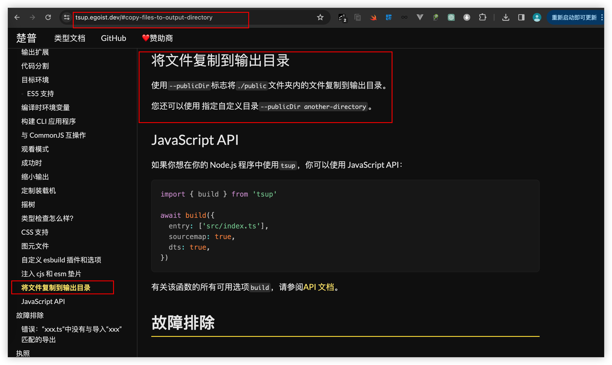

## 问题：通过tsup.config.ts配置文件进行build 在Vercel构建部署失败最终解决方案为：
- 在本地通过命令`pnpm build` 进行构建完成后，将build上传到git上；并且配置好vercel.json文件即可：

- vercel.json文件内容：
```json
{
  "builds": [
    {
      "src": "build/app.mjs",
      "use": "@vercel/node"
    }
  ],
  "routes": [
    {
      "src": "/(.*)",
      "dest": "build/app.mjs"
    }
  ]
}

```


#### 思考
注意出现问题要学会思考，学会参照，比如这次出问题，其实大致的思路就是一个打包发版的概念，但是开始一直纠结vercel配置文件是否编写的有问题了。


## 问题：请求路径与在主文件中挂载路由时使用的路径一致，但是通过export的无法获取req.body


如果你的请求路径和主文件中挂载的路由路径一致，但仍然无法获取 req.body，可能有几个原因需要检查：

1. 中间件配置： 确保在主文件中正确使用了 express.json() 中间件来解析请求体。在你的主文件中，你已经使用了这个中间件，但是确认一下是否正确配置。

```
const express = require('express');
const app = express();

app.use(express.json());
```

2. 请求内容类型： 确保请求头中的 Content-Type 设置为 'application/json'。如果你使用其他类型的数据（例如表单数据），你可能需要使用相应的中间件（例如 body-parser）来解析不同类型的请求体。
```
fetch('http://localhost:3003/chat/chat-process', {
  method: 'POST',
  headers: {
    'Content-Type': 'application/json',
  },
  body: JSON.stringify({
    prompt: 'your_prompt_value',
    // 其他属性...
  }),
});
```


3. 检查请求体内容： 在请求体中确保有有效的 JSON 数据，包含了 'prompt' 属性。

```
{
  "prompt": "your_prompt_value",
  // 其他属性...
}
```

4. 路由路径是否一致： 请确保在路由模块文件中和主文件中都使用了相同的路径。

主文件：
```

app.use('/chat', chatRouter);
```

路由文件：
```
router.post('/chat-process', [auth, limiter], async (req, res) => {
  // ...
});
```


// 文件中正确使用了 express.json() 中间件来解析请求体 不配置这个可能会无法获取 req.body
// app.use(express.json());


 // 在服务器端的响应头中设置 Cache-Control: no-cache 来确保不进行缓存。 确保浏览器和服务器没有对 SSE 请求进行缓存
  res.setHeader('Cache-Control', 'no-cache');


## 关于tsup静态文件的访问配置
参考官方文档：https://tsup.egoist.dev/#javascript-api



修改`package.json`脚本中的命令
主要是添加一个 `--publicDir`

```
# 由 
"build": "pnpm clean && tsup",
# 变成
"build": "pnpm clean && tsup --publicDir",
```

